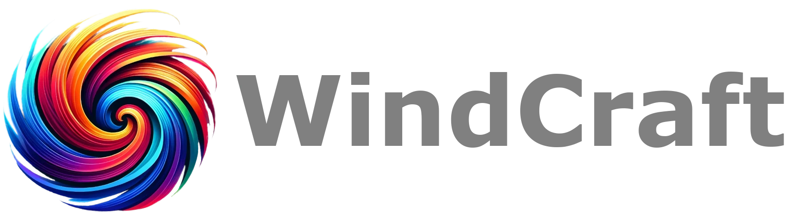

# WindCraft UI

This repository is a collection of components to get started with a new project. It's based of the React Aria Components Tailwind Starter Kit and modified to use the Shadcn-ui Themes.

* [React](https://reactjs.org/)
* [TypeScript](https://www.typescriptlang.org/)
* [Tailwind CSS](https://tailwindcss.com/)
* [React Aria Components](https://react-spectrum.adobe.com/react-aria/getting-started.html)
* [Shadcn Themes](https://ui.shadcn.com)

## Why?

We want to share the work we have done in our projects, these components are part of the setup in [PlatformPlatform](https://github.com/platformplatform/PlatformPlatform) an enterprise grade platform for building web applications. Due to the 

We are inspired by the work of [Adobe Spectrum](https://react-spectrum.adobe.com/react-aria/getting-started.html), [Tailwind CSS](https://tailwindcss.com/) and last but not least [Shadcn Themes](https://ui.shadcn.com) 🤩

## Getting Started

We have included licenses for all the dependencies, please make sure to include them in your project and give due credit. Also consider supporting the projects that have made this possible 🙏

### Installation

Copy the components from `src` you need into your project, we are working on a way to make this easier.

For now we use the Shadcn-ui Themes check out the [Shadcn Guide](https://ui.shadcn.com/docs/installation/manual) for more information.

## Contributing

We are open to contributions, please make sure to reachoutfollow the [Code of Conduct](.github/CODE_OF_CONDUCT.md) and the [Contributing Guidelines](.github/CONTRIBUTING.md).